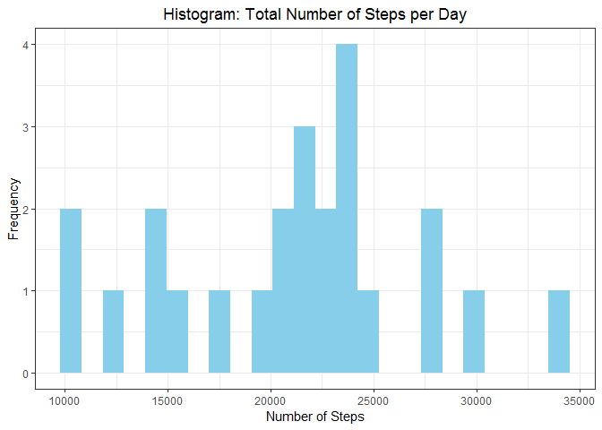
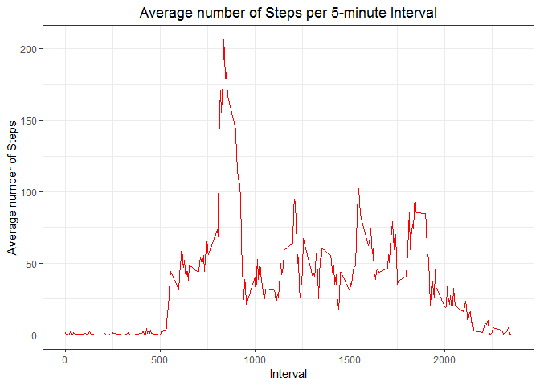

```r
library(dplyr)
library(ggplot2)
library(knitr)
library(lattice)
opts_chunk$set(echo = TRUE, results = 'hold')
```

## Loading and preprocessing the data 

```r
if (!file.exists("activity.csv")) {                                 # unzip data
    pathFile <- paste0(getwd(), "/activity.zip")
    unzip(pathFile)}

activity <- read.csv(file = "activity.csv", header = TRUE)          # read data
activity <- unique(activity)                                        # keep only unique records
activity$date <- as.Date(as.character(activity$date), "%Y-%M-%d")   # change date format

head(activity)
```

```
##   steps       date interval
## 1    NA 2012-10-01        0
## 2    NA 2012-10-01        5
## 3    NA 2012-10-01       10
## 4    NA 2012-10-01       15
## 5    NA 2012-10-01       20
## 6    NA 2012-10-01       25
```

## What is mean total number of steps taken per day?
1. Calculate the total number of steps taken per day

```r
stepsPerDay <- tapply(activity$steps, activity$date, sum)
```

2. Make a histogram of the total number of steps taken each day

```r
df <- data.frame(date = names(stepsPerDay), stepsPerDay = stepsPerDay)

g1 <- ggplot(df, aes(stepsPerDay)) + geom_histogram(bins = 24, fill = "sky blue", na.rm = TRUE)  
g1 <- g1 + labs(title = "Histogram: Total Number of Steps per Day", x = "Number of Steps", y = "Frequency") 
g1 <- g1 + theme_bw() + theme(plot.title = element_text(hjust = 0.5))
plot(g1)
```



3. Calculate and report the mean and median of the total number of steps taken per day

```r
stepsPerDay_mean <- mean(stepsPerDay, na.rm = TRUE)
stepsPerDay_median <- median(stepsPerDay, na.rm = TRUE)
```
Calculated **mean** and **median** *(rounded to 2 decimal digits)* for **Total Number of Steps per Day** are as following:  

* Mean: `21151.88`
* Median: `21782`

## What is the average daily activity pattern?

1. Make a time series plot (i.e. type="l") of the 5-minute interval (x-axis) and the average number of steps taken, averaged across all days (y-axis)

```r
stepsPerInverval_mean <- aggregate(steps ~ interval, activity, FUN = mean, na.rm = TRUE)

g2 <- ggplot(stepsPerInverval_mean, aes(x = interval, y = steps)) + geom_line(color = "red")
g2 <- g2 + labs(title = "Average number of Steps per 5-minute Interval", x = "Interval", y = "Average number of Steps") + theme_bw() + theme(plot.title = element_text(hjust = 0.5))
plot(g2)
```



2. Which 5-minute interval, on average across all the days in the dataset, contains the maximum number of steps?

```r
stepsPerInterval_max <- max(stepsPerInverval_mean$steps)
stepsPerInverval_intervalForMax <- stepsPerInverval_mean[stepsPerInverval_mean$steps == stepsPerInterval_max,]
```

The `835`interval has on average the maximum number of steps, `206`.

## Imputing missing values

1. Calculate and report the total number of missing values in the dataset (i.e. the total number of rows with NAs)

```r
nMissing <- sum(is.na(activity$steps))
```
There is `2304` missing values.  

2. Devise a strategy for filling in all of the missing values in the dataset. The strategy does not need to be sophisticated. For example, you could use the mean/median for that day, or the mean for that 5-minute interval, etc.

```r
allMissing <- activity[is.na(activity$steps),]
missingPer <- 100*nMissing/dim(activity)[1]
missingDates <- unique(allMissing$date)
allDates <- unique(activity$date)
```
In data set there is 13.11% missing values, for `7` days out of total `31`days.  
As data for the whole day(s) is missing the best approach will be to fill missing values with mean value for 5-minute intervals calculated based on the whole month of data.  

3. Create a new dataset that is equal to the original dataset but with the missing data filled in.

```r
activity2 <- merge(x = activity[is.na(activity$steps),], y = stepsPerInverval_mean, by = "interval") %>% select(- steps.x) %>% rename(steps = steps.y) 
activity2 <- rbind(activity[!is.na(activity$steps),], activity2) %>% arrange(date, interval)
head(activity2)
```

```
##       steps       date interval
## 1 1.7169811 2012-10-01        0
## 2 1.7169811 2012-10-01        0
## 3 0.3396226 2012-10-01        5
## 4 0.3396226 2012-10-01        5
## 5 0.1320755 2012-10-01       10
## 6 0.1320755 2012-10-01       10
```
4. Make a histogram of the total number of steps taken each day and Calculate and report the mean and median total number of steps taken per day.

```r
stepsPerDay_NoMissingValues <- tapply(activity2$steps, activity2$date, sum)
df2 <- data.frame(date = names(stepsPerDay_NoMissingValues), stepsPerDay = stepsPerDay)

g3 <- ggplot(data = df2, aes(stepsPerDay)) + geom_histogram(bins = 24, fill = "sky blue", na.rm = TRUE) 
g3 <- g3 + labs(title = "Histogram of Steps per Day - data with NAs replaced", x = "Number of Steps per Day", y = "Frequency for binwidth = 500") + theme_bw() + theme(plot.title = element_text(hjust = 0.5))
plot(g3)
```


```r
stepsPerDayNoMissing_mean <- mean(stepsPerDay_NoMissingValues, na.rm = TRUE)
stepsPerDayNoMissing_median <- median(stepsPerDay_NoMissingValues, na.rm = TRUE)
```
Calculated **mean** and **median** *(rounded to 2 decimal digits)* for **Total Number of Steps per Day** after filling missing values are as following:  

* Mean: `21185.08`
* Median: `21641`    

Do these values differ from the estimates from the first part of the assignment? What is the impact of imputing missing data on the estimates of the total daily number of steps?

characteristic | With NAs | Without NAs |change
------------- | ------------- | ------------- | -------------
mean | `21151.88` | `21185.08` | `0.16`%
median | `21782` | `21641` | `-0.65`%  
As displayed above, replacing NA values has minimal impact on mean and median values.  

## Are there differences in activity patterns between weekdays and weekends?
1. Create a new factor variable in the dataset with two levels – “weekday” and “weekend” indicating whether a given date is a weekday or weekend day.

```r
activity3 <- mutate(activity2, wday = factor(weekdays(date) %in% c("Saturday", "Sunday"), levels = c(TRUE, FALSE), labels = c("weekend", "weekday")))
```
2. Make a panel plot containing a time series plot (i.e. type = "l) of the 5-minute interval (x-axis) and the average number of steps taken, averaged across all weekday days or weekend days (y-axis).  
See the README file in the GitHub repository to see an example of what this plot should look like using simulated data.

```r
stepsPerInvervalPerWeekday_mean <- aggregate(steps ~ interval + wday, activity3, FUN = mean, na.rm = TRUE)
xyplot(steps ~ interval | wday, stepsPerInvervalPerWeekday_mean, type = "l", layout = c(1,2), main = "Weekday vs. Weekend Number Steps per Interval", xlab = "Interval", ylab = "Number of Steps")
```


Above we can see that weekend has more peaks than weekday but their are much lower. The first weekend peak appeares before first weekday peak, and last weekend peak appears after last weekday peak. It can be result of weekday routine with morning commute and weekend sport activities, i.e. walking.
